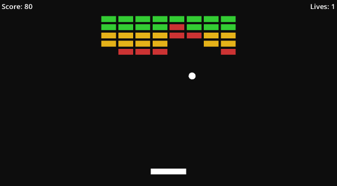

# Breakout with Godot Deus

> Classic Breakout clone built entirely with the [Godot Deus](https://github.com/elgatopanzon/deus) ECS plugin - every mechanic runs through components and pipelines, no node scripts.



## Quick Start

1. Clone the repo (including the Deus addon):
   ```
   git clone https://github.com/elgatopanzon/deus-breakout.git
   ```
2. Open in Godot 4.6
3. Press F5 to run

The Deus autoload is pre-configured in `project.godot`. No additional setup needed.

## About

This is a fully playable Breakout clone where paddle input, ball physics, brick damage, scoring, lives, and win/lose conditions are all implemented as Deus ECS pipelines. Scene files declare entity data via DeusConfiguration nodes. A single bootstrap script (`Main.gd`) registers pipelines with the scheduler and sets up injection chains. There are no scripts on entities or UI elements.

The project serves as a reference for building a complete game with the Deus ECS framework.

## Examples

### Component: pure data container

```gdscript
class_name Health extends DefaultComponent
@export var value: int = 1
```

Components hold data. Pipelines read and write them. `@export` makes fields editable in DeusConfiguration nodes.

### Pipeline: scheduled system

```gdscript
class_name DamagePipeline extends DefaultPipeline

static func _requires(): return [Health, Damage]

static func _stage_apply(context):
    if context.Damage.value <= 0:
        return
    context.Health.value -= context.Damage.value
    context.Damage.value = 0
```

`_requires()` declares which components an entity must have. The scheduler runs this every frame on all matching entities. Component access is via `context.<ComponentName>`.

### Pipeline injection: gate pattern

```gdscript
class_name BallMissedPipeline extends DefaultPipeline

static func _requires(): return [Position, Velocity, Size]

static func _stage_detect(context):
    var vp = context._node.get_viewport_rect().size
    var bottom_clamp = vp.y - context.Size.value.y
    if context.Position.value.y < bottom_clamp:
        context.result.cancel("ball not at bottom")
```

`context.result.cancel()` stops all injected downstream pipelines (LivesDecrementPipeline, GameOverPipeline, BallRespawnPipeline) from running. This is how Deus handles conditional execution chains.

### Declarative entity setup (Brick.tscn)

```
Brick (Area2D)
  Visual (ColorRect)
  CollisionShape2D
  DeusConfiguration
    node_id = "brick"
    components = [Health(1), Damage(0), Size(50, 20)]
    signals_to_pipelines = [area_entered -> BrickCollisionPipeline]
```

No code needed to set up an entity. DeusConfiguration attaches components in `_enter_tree()` and wires signals in `_ready()`.

### Bootstrap (Main.gd)

```gdscript
# Scheduled pipelines (run every frame)
for pipeline in [TouchZoneInputPipeline, PaddleInputPipeline,
    TouchPaddleInputPipeline, MovementPipeline, PositionClampPipeline,
    BallMovementPipeline, WallReflectionPipeline, DamagePipeline,
    DestructionPipeline, BallMissedPipeline,
    PausePipeline, HUDSyncPipeline, OverlaySyncPipeline]:
    Deus.register_pipeline(pipeline)
    Deus.pipeline_scheduler.register_task(PipelineSchedulerDefaults.OnUpdate, pipeline)

# Visual sync reacts to health changes instead of running per-frame
Deus.inject_pipeline(BrickVisualSyncPipeline, Callable(DamagePipeline, "_stage_apply"), false)

# Pause guard injects before gameplay pipelines — cancels when not playing
Deus.inject_pipeline(PauseGuardPipeline, Callable(TouchZoneInputPipeline, "_stage_detect_touch"), true)
Deus.inject_pipeline(PauseGuardPipeline, Callable(TouchPaddleInputPipeline, "_stage_read_touch"), true)

# Scoring injects before destruction so components are still readable
Deus.inject_pipeline(ScoringPipeline, Callable(DestructionPipeline, "_stage_destroy"), true)

# Game state singletons on world node
Deus.set_component(Deus, Score, Score.new())
Deus.set_component(Deus, Lives, Lives.new())
Deus.set_component(Deus, GameState, GameState.new())
```

`Main.gd` is the only script in the project. It registers pipelines, sets up injection order, and initializes world-level state.

## Project Structure

```
classes/
  components/    # 18 data containers (Health, Velocity, Score, Combo, ScreenShake, SoundBank, ...)
  pipelines/     # 54 systems (DamagePipeline, BallMovementPipeline, ScreenShakePipeline, ...)
scenes/
  Main.tscn          # Root scene with Paddle, Ball, HUD, TouchControls, Camera2D, AudioPool
  Main.gd            # Bootstrap: pipeline registration, injection, and singleton setup
  Ball.tscn          # Ball entity with DeusConfiguration
  Brick.tscn         # Brick entity template with DeusConfiguration
  Paddle.tscn        # Paddle entity with DeusConfiguration
  HUD.tscn           # UI layer (score, lives, combo, overlays) - no scripts
  TouchControls.tscn # Invisible left/right touch zones for Android
  effects/
    BallSpark.tscn   # Spark particles on ball impacts
    BrickDebris.tscn # Debris particles on brick destruction
    DustPuff.tscn    # Dust cloud particles
assets/
  audio/             # 9 sfx (paddle_hit, brick_break, wall_bounce, ball_launch, ...)
addons/deus/     # Godot Deus ECS framework
```

## Tech Stack

| Category | Technology |
|----------|-----------|
| Engine | Godot 4.6 |
| Language | GDScript |
| Framework | [Godot Deus](https://github.com/elgatopanzon/deus) ECS plugin |
| Targets | Desktop (Linux, Windows, macOS), Android, Web (HTML5) |

## Roadmap

### Phase 1: MVP
- [x] Paddle entity
- [x] Ball entity
- [x] Brick entities
- [x] Score and lives tracking
- [x] Win/lose conditions
- [x] Basic UI

### Phase 2: Game Feel & Polish
- [x] Android touch controls
- [x] Visual effects and screen shake on brick destruction
- [x] Particle effects for ball impacts and brick breaks
- [x] Sound design (paddle hit, brick break, wall bounce, game over, win, ball launch, life lost, UI click)
- [x] Animations and transitions (level start, life lost, game won, game over)
- [x] Game feel tuning and juice (hitstop, combo system, ball speed curve, squash-and-stretch)

### Phase 3: Content & Levels
- [ ] Multiple brick layouts and level designs
- [ ] Level progression system
- [ ] Difficulty scaling (ball speed, brick durability, paddle size)
- [ ] Power-ups (multi-ball, wide paddle, laser, etc.)

### Phase 4: Performance
- [ ] Various performance optimizations (caching, pooling, etc.)

## Completed Work

Recent fixes and improvements (February 2026):
- **2026-02-18** - Static node cache reset on scene reload (prevents freed-instance crashes)
- **2026-02-18** - Pass component via payload to signal-driven pipelines (avoids stale registry read)
- **2026-02-18** - Bind WinAnimationPipeline tweens to world node instead of dying brick
- **2026-02-18** - Convert animation pipelines from oneshot to manual deregistration
- **2026-02-18** - WinAnimationPipeline requires [] to avoid noop-cancelling brick collision chain
- **2026-02-18** - Event-driven pipeline conversion for scheduled pipelines (P10-G1-G4)

Game mechanic implementation (January-February 2026):
- **2026-02-02** - Sound design (9 sfx: paddle hit, brick break/hit, wall bounce, ball launch, life lost, game over, win, UI click)
- **2026-02-02** - Custom scheduler phases (Input > Physics > Effects) replacing priority numbers
- **2026-02-01** - Combo system with multiplier tiers and HUD display
- **2026-02-01** - Hitstop (brief frame freeze on brick destruction)
- **2026-02-01** - Ball speed curve (gradual ramp during play, reset on life lost)
- **2026-02-01** - Squash-and-stretch (paddle stretch on hit, brick squeeze on damage)
- **2026-02-01** - Win and game over overlay animations (tweens)
- **2026-02-01** - Life lost animation (freeze, flash, ball drop-in)
- **2026-02-01** - Level start animation (brick pop-in, paddle slide, ball drop)
- **2026-02-01** - Particle effects (brick debris, dust puffs, ball sparks, wall/paddle sparks)
- **2026-02-01** - Screen shake with decaying random camera offset
- **2026-02-01** - Hit flash and impact burst on brick damage
- **2026-01-31** - Android touch controls
- **2026-01-31** - Basic UI (HUD, overlays, pause)
- **2026-01-31** - Win/lose conditions
- **2026-01-31** - Score and lives tracking
- **2026-01-31** - Brick entities with health tiers and visual sync
- **2026-01-31** - Ball entity with physics and deflection
- **2026-01-29** - Paddle entity with input and movement
